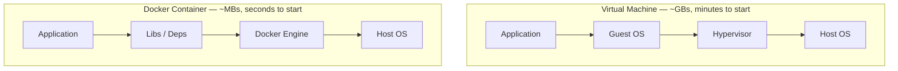
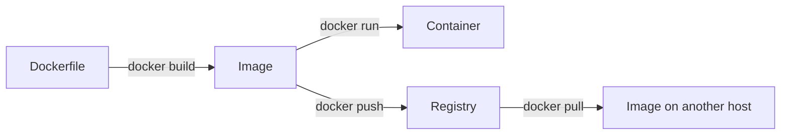

# 01 — Docker Basics

## What is Docker?

Docker is a platform for packaging applications and their dependencies into **containers** — lightweight, portable, isolated units that run the same everywhere.

### Key Concepts

| Term | Description |
|---|---|
| **Image** | Read-only blueprint for a container (like a class in OOP) |
| **Container** | A running instance of an image (like an object) |
| **Dockerfile** | Instructions to build an image |
| **Registry** | Remote store for images (Docker Hub, ECR, GCR) — see [docker-hub-and-registries.md](./docker-hub-and-registries.md) |
| **Layer** | Each instruction in a Dockerfile adds a cached layer — see [image-layers.md](./image-layers.md) |

### Docker vs Virtual Machine



The key difference: a VM ships a whole **Guest OS** per app, while containers **share the host kernel** — no full OS per app. (Full deep dive: [virtualization-vs-containers.md](./virtualization-vs-containers.md).)

## Installation

### Linux (Ubuntu/Debian)
```bash
curl -fsSL https://get.docker.com | sh
sudo usermod -aG docker $USER   # run Docker without sudo
newgrp docker
```

### macOS / Windows
Download **Docker Desktop** from [docker.com](https://www.docker.com/products/docker-desktop/).  
Windows users: enable WSL2 integration in Docker Desktop settings.

### Verify
```bash
docker --version          # e.g. Docker version 26.1.0
docker compose version    # e.g. Docker Compose version v2.27.0
docker run --rm hello-world
```

## How Docker Works



## Your First Dockerfile

```dockerfile
# Base image
FROM python:3.12-slim

# Set working directory inside container
WORKDIR /app

# Copy dependency list and install
COPY requirements.txt .
RUN pip install --no-cache-dir -r requirements.txt

# Copy application source
COPY . .

# Default command
CMD ["python", "app.py"]
```

Build and run it:
```bash
docker build -t my-app .
docker run -p 8080:8080 my-app
```

## Files in This Section

- [first-container.md](./first-container.md) — step-by-step walkthrough of your first container
- [writing-a-dockerfile-step-by-step.md](./writing-a-dockerfile-step-by-step.md) — beginner-friendly step-by-step process for writing a Dockerfile, every option explained in plain language with the "why" behind each line
- [dockerfile-reference.md](./dockerfile-reference.md) — every Dockerfile instruction explained
- [image-layers.md](./image-layers.md) — what layers are, how caching works, overlay2, copy-on-write, and best practices
- [docker-hub-and-registries.md](./docker-hub-and-registries.md) — Docker Hub, image naming, tags, pushing your first image, private registries, rate limits
- [build-and-push-guide.md](./build-and-push-guide.md) — complete workflow: lightweight Dockerfile, multi-stage build, tagging with version + latest, pushing to Docker Hub
- [virtualization-vs-containers.md](./virtualization-vs-containers.md) — what hypervisors are, Type 1 vs Type 2, how containers differ (with diagrams)
- [devops-roadmap.md](./devops-roadmap.md) — where Docker fits in the DevOps career path and skill map

## Next

→ [02 — Commands](../02-commands/)
