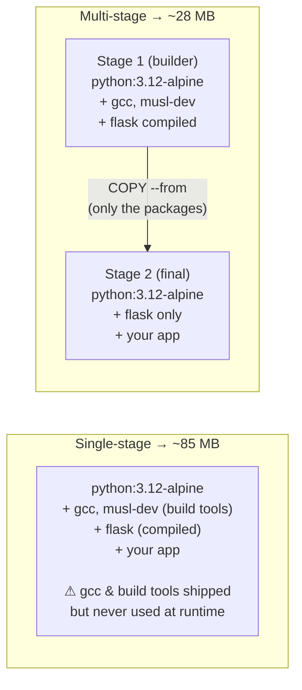
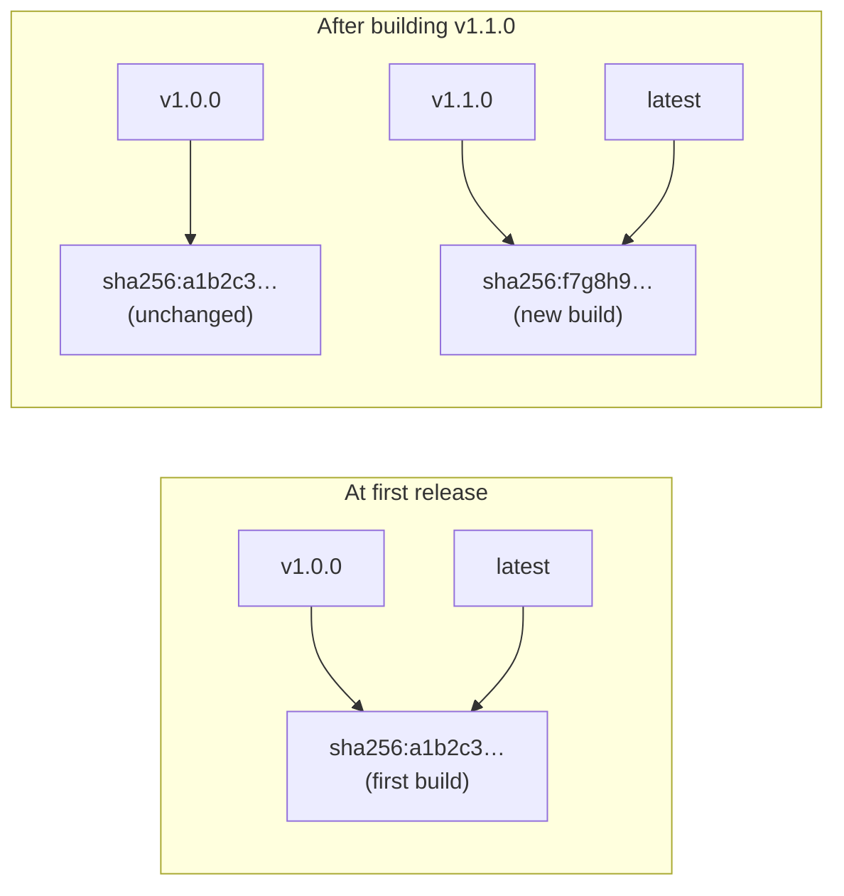
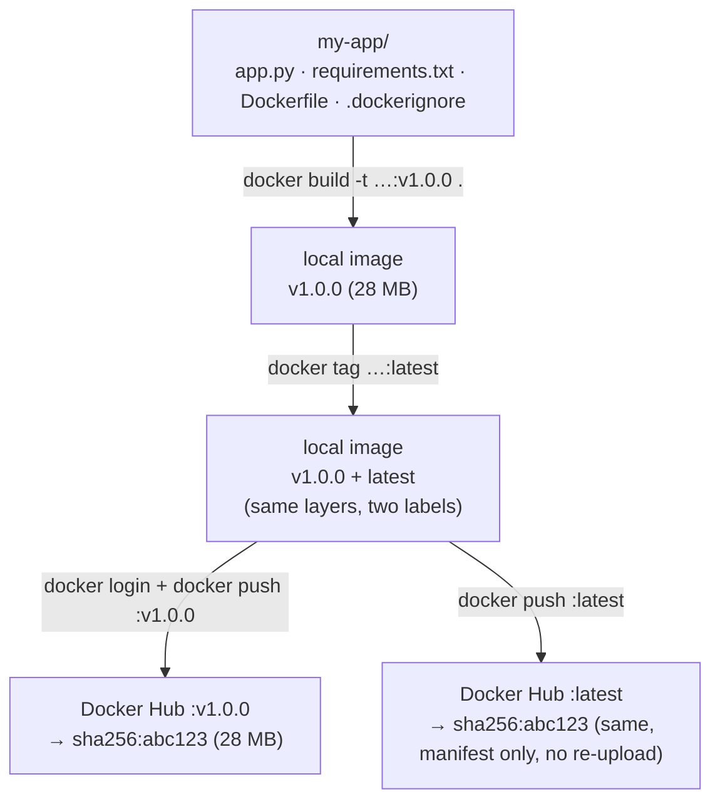

# Building a Lightweight Docker Image and Pushing to Docker Hub

> This guide walks through the complete workflow: writing a minimal Dockerfile, building a small image, and pushing it to Docker Hub with both a version tag and `latest` — the two-tag pattern used in every real project.

---

## 1. Why Lightweight Images Matter

Every byte in your image is a byte you download at deploy time, a byte stored in the registry, and a larger attack surface for vulnerabilities.

| | Large image (`node:20`) | Lightweight image (`node:20-alpine`) |
|---|---|---|
| Size on disk | ~1.1 GB | ~160 MB |
| Contains | full Debian OS, docs, man pages, build tools, package cache | Alpine Linux (~5 MB base) + only what the app needs |
| Cold starts | slower | faster |
| CVEs to patch | more | smaller attack surface |
| Registry storage | large | ~7× less |

The standard choice for lightweight images is **Alpine Linux** — a minimal distribution built on musl libc and BusyBox. Most official Docker images offer an `-alpine` variant.

### Base Image Size Comparison

| Base image | Compressed size | Typical use |
|---|---|---|
| `ubuntu:22.04` | ~30 MB | Full OS, debugging |
| `debian:bookworm` | ~48 MB | Standard Debian baseline |
| `python:3.12` | ~358 MB | Includes full Debian + Python |
| `python:3.12-slim` | ~45 MB | Strips docs, extras from Debian |
| `python:3.12-alpine` | ~18 MB | Alpine base — smallest option |
| `scratch` | 0 MB | No OS at all — compiled binaries only |

> **Rule of thumb:** always use the smallest base that still runs your app. Start with `-slim` or `-alpine` variants of official images.

---

## 2. The Sample Application

We'll containerise a minimal Python Flask API that returns a JSON response.

**Project structure:**

```
my-app/
├── app.py
├── requirements.txt
├── Dockerfile
└── .dockerignore
```

**`app.py`**

```python
from flask import Flask, jsonify

app = Flask(__name__)

@app.route("/")
def home():
    return jsonify({"message": "Hello from Docker!", "status": "ok"})

if __name__ == "__main__":
    app.run(host="0.0.0.0", port=5000)
```

**`requirements.txt`**

```
flask==3.0.3
```

---

## 3. Writing a Lightweight Dockerfile

```dockerfile
# ── Stage 1: dependency installer ──────────────────────────────────────────
FROM python:3.12-alpine AS builder

WORKDIR /app

# Install build tools needed only for compiling C extensions
# --no-cache avoids saving the apk package index to the layer
RUN apk add --no-cache gcc musl-dev libffi-dev

COPY requirements.txt .

# Install into a prefix so we can copy just the venv in stage 2
RUN pip install --no-cache-dir --prefix=/install -r requirements.txt


# ── Stage 2: runtime image ─────────────────────────────────────────────────
FROM python:3.12-alpine

WORKDIR /app

# Copy only the installed packages from the builder — no gcc, no build tools
COPY --from=builder /install /usr/local

# Copy application source
COPY app.py .

# Non-root user — never run as root in production
RUN addgroup -S appgroup && adduser -S appuser -G appgroup
USER appuser

EXPOSE 5000

CMD ["python", "app.py"]
```

### Why Multi-Stage?

**Single-stage** drags the compiler into production; **multi-stage** leaves it behind:



Only the installed packages move into the final image — `gcc` and the build tools stay behind in the discarded builder stage.

### Layer Order Matters for Build Cache

```dockerfile
# WRONG — source code copied before deps, so pip reinstalls on every code change
COPY . .
RUN pip install -r requirements.txt

# RIGHT — deps copied and installed first, pip is cached until requirements change
COPY requirements.txt .
RUN pip install -r requirements.txt
COPY app.py .
```

See [image-layers.md](./image-layers.md) for the full caching explanation.

---

## 4. The `.dockerignore` File

Prevents unwanted files from entering the build context — keeps builds fast and the image clean.

```
# .dockerignore
__pycache__/
*.pyc
*.pyo
.env
.git/
.gitignore
*.md
*.log
venv/
.venv/
```

| | Build context sent to daemon |
|---|---|
| **Without** `.dockerignore` | 45 MB (includes `.git`, `venv`, logs) |
| **With** `.dockerignore` | 4 KB (only `app.py`, `requirements.txt`, `Dockerfile`) |

---

## 5. Building the Image

Navigate to your project directory (where the `Dockerfile` lives):

```bash
docker build -t cloudprakhargupta/docker-app-images:v1.0.0 .
```

**Breaking down the command** `docker build -t cloudprakhargupta/docker-app-images:v1.0.0 .`

| Part | Meaning |
|---|---|
| `docker build` | the build command |
| `-t` | tag the resulting image |
| `cloudprakhargupta` | Docker Hub namespace (your username) |
| `docker-app-images` | repository name |
| `v1.0.0` | tag (version) |
| `.` | build context (the current directory) |

**Expected output:**

```
[+] Building 18.3s (12/12) FINISHED
 => [internal] load build definition from Dockerfile
 => [internal] load .dockerignore
 => [builder 1/5] FROM python:3.12-alpine
 => [builder 2/5] RUN apk add --no-cache gcc musl-dev libffi-dev
 => [builder 3/5] COPY requirements.txt .
 => [builder 4/5] RUN pip install --no-cache-dir --prefix=/install -r requirements.txt
 => [stage-2 1/4] FROM python:3.12-alpine
 => [stage-2 2/4] COPY --from=builder /install /usr/local
 => [stage-2 3/4] COPY app.py .
 => [stage-2 4/4] RUN addgroup -S appgroup && adduser -S appuser -G appgroup
 => exporting to image
 => => naming to docker.io/cloudprakhargupta/docker-app-images:v1.0.0
```

**Verify the build:**

```bash
docker images cloudprakhargupta/docker-app-images

# REPOSITORY                              TAG       IMAGE ID       SIZE
# cloudprakhargupta/docker-app-images     v1.0.0    a1b2c3d4e5f6   28.4MB
```

**Test it locally before pushing:**

```bash
docker run --rm -p 5000:5000 cloudprakhargupta/docker-app-images:v1.0.0
# Visit http://localhost:5000 — should return {"message":"Hello from Docker!","status":"ok"}
```

---

## 6. Tagging Strategy: Version Tag + `latest`

Every image push should carry **two tags**:

| Tag | Purpose | Example |
|---|---|---|
| **Version tag** | Pinned, immutable reference — always points to this exact build | `v1.0.0` |
| **`latest`** | Moving pointer to the most recent stable release — what users get when they don't specify a tag | `latest` |

Tags are just labels pointing at an image digest. `latest` *moves*; version tags stay put:



Tags are **mutable labels** — `latest` moves with each release while version tags stay fixed, so users can always roll back to `v1.0.0` if the latest is broken.

### Apply the `latest` tag locally

You already have the image tagged as `v1.0.0`. Add a second tag pointing to the same image:

```bash
docker tag cloudprakhargupta/docker-app-images:v1.0.0 \
           cloudprakhargupta/docker-app-images:latest
```

`docker tag` creates an alias — it does not copy or duplicate the image. Both tags point to the same layer set.

**Verify:**

```bash
docker images cloudprakhargupta/docker-app-images

# REPOSITORY                              TAG       IMAGE ID       SIZE
# cloudprakhargupta/docker-app-images     latest    a1b2c3d4e5f6   28.4MB
# cloudprakhargupta/docker-app-images     v1.0.0    a1b2c3d4e5f6   28.4MB
#
# Notice: same IMAGE ID — only one image on disk, two tag labels
```

---

## 7. Logging in to Docker Hub

```bash
docker login
# Username: cloudprakhargupta
# Password: <your access token>
# Login Succeeded
```

**Use an Access Token — not your password** (safer for scripts and CI):

1. Go to [hub.docker.com](https://hub.docker.com) → Account Settings → Security → New Access Token
2. Give it a name (e.g. `local-dev`) and set access to **Read, Write, Delete**
3. Copy the token and paste it as the password

Credentials are saved to `~/.docker/config.json` after login.

---

## 8. Pushing Both Tags to Docker Hub

Push the version tag first, then latest:

```bash
# Push the pinned version
docker push cloudprakhargupta/docker-app-images:v1.0.0

# Push the latest alias
docker push cloudprakhargupta/docker-app-images:latest
```

**What happens during a push:**

```
docker push cloudprakhargupta/docker-app-images:v1.0.0

The push refers to repository [docker.io/cloudprakhargupta/docker-app-images]

Step 1: Docker contacts registry
        POST /v2/cloudprakhargupta/docker-app-images/blobs/uploads/

Step 2: For each layer:
        - Check if the registry already has this layer (by digest)
        - "Layer already exists" → skip upload (fast!)
        - "Pushed" → upload compressed layer

Step 3: Upload the image manifest (JSON that lists all layers)
        The tag v1.0.0 now points to this manifest

b3c4d5e6f7a8: Pushed           ← your app code layer
c9d0e1f2a3b4: Pushed           ← pip packages layer
a8b9c0d1e2f3: Layer already exists  ← python:3.12-alpine base (shared in registry)
v1.0.0: digest: sha256:abc123... size: 1234
```

**The second push (`latest`) is nearly instant** — the layers are already uploaded, Docker only uploads a new manifest pointing to the same layers.

```bash
docker push cloudprakhargupta/docker-app-images:latest

# b3c4d5e6f7a8: Layer already exists
# c9d0e1f2a3b4: Layer already exists
# a8b9c0d1e2f3: Layer already exists
# latest: digest: sha256:abc123... size: 1234
#
# Same digest as v1.0.0 — confirmed same image, different label
```

---

## 9. Full Workflow Diagram



---

## 10. Verifying the Push

Check the image is live from another machine or after clearing local cache:

```bash
# Remove local copies to simulate a fresh pull
docker rmi cloudprakhargupta/docker-app-images:v1.0.0
docker rmi cloudprakhargupta/docker-app-images:latest

# Pull by version — reproducible, always this exact image
docker pull cloudprakhargupta/docker-app-images:v1.0.0

# Pull latest — always the most recent release
docker pull cloudprakhargupta/docker-app-images:latest

# Run and verify
docker run --rm -p 5000:5000 cloudprakhargupta/docker-app-images:v1.0.0
```

---

## 11. Releasing a New Version

When you update your app and need to push `v1.1.0`:

```bash
# 1. Build with the new version tag
docker build -t cloudprakhargupta/docker-app-images:v1.1.0 .

# 2. Move latest to the new version
docker tag cloudprakhargupta/docker-app-images:v1.1.0 \
           cloudprakhargupta/docker-app-images:latest

# 3. Push both
docker push cloudprakhargupta/docker-app-images:v1.1.0
docker push cloudprakhargupta/docker-app-images:latest
```

After this, on Docker Hub:
- `v1.0.0` → still points to the original build (rollback available)
- `v1.1.0` → new build
- `latest` → now points to `v1.1.0`

---

## 12. Quick Reference

```bash
# ── Build ────────────────────────────────────────────────────────────────────
docker build -t cloudprakhargupta/docker-app-images:v1.0.0 .

# ── Tag ─────────────────────────────────────────────────────────────────────
docker tag cloudprakhargupta/docker-app-images:v1.0.0 \
           cloudprakhargupta/docker-app-images:latest

# ── Inspect size ────────────────────────────────────────────────────────────
docker images cloudprakhargupta/docker-app-images
docker history cloudprakhargupta/docker-app-images:v1.0.0

# ── Test locally ─────────────────────────────────────────────────────────────
docker run --rm -p 5000:5000 cloudprakhargupta/docker-app-images:v1.0.0

# ── Login ────────────────────────────────────────────────────────────────────
docker login

# ── Push ─────────────────────────────────────────────────────────────────────
docker push cloudprakhargupta/docker-app-images:v1.0.0
docker push cloudprakhargupta/docker-app-images:latest

# ── Verify (pull after clearing local cache) ─────────────────────────────────
docker rmi cloudprakhargupta/docker-app-images:v1.0.0
docker pull cloudprakhargupta/docker-app-images:v1.0.0
```

---

## Related

- [Dockerfile reference](./dockerfile-reference.md) — every Dockerfile instruction explained
- [Image layers](./image-layers.md) — how layers are cached, shared, and stored
- [Docker Hub and registries](./docker-hub-and-registries.md) — Docker Hub account setup, naming, rate limits, private registries
- [Image commands reference](../02-commands/image-commands.md) — full build/tag/push/pull command reference
