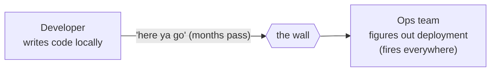
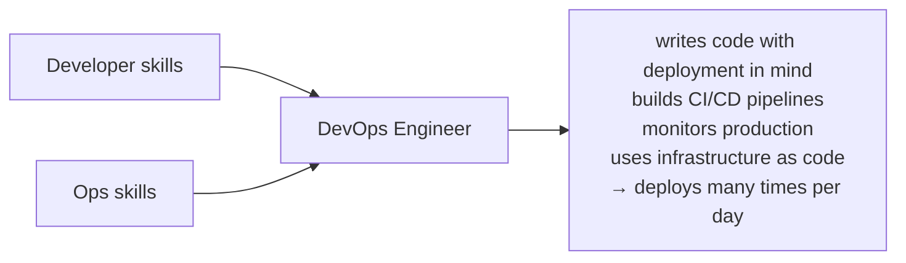
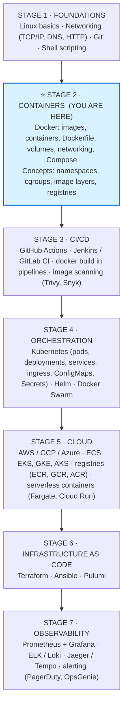

# Docker in the DevOps Roadmap

> This guide shows exactly where Docker fits in the broader DevOps skill set and how mastering it accelerates a role switch.

---

## What is DevOps?

DevOps is the practice of **closing the gap between development (writing code) and operations (running code in production)**. Instead of developers throwing code over the wall to ops, both sides share tools, processes, and responsibility.

**Traditional (siloed)** — slow, and problems surface only after handoff:

**DevOps (collaborative)** — one role owns code *and* its delivery:

---

## The DevOps Roadmap — Where Docker Fits

---

## Why Docker is the Best Starting Point

Docker sits at **Stage 2**, but it unlocks everything after it. Without Docker knowledge:

| You can't really do… | …because |
|---|---|
| **CI/CD** | "build the Docker image" is step 1 in nearly every pipeline |
| **Kubernetes** | K8s *runs* containers — you must know images and Compose first |
| **Cloud** | ECS, EKS, Cloud Run, and Fargate all run Docker containers |
| **IaC** | Terraform modules often provision container infrastructure |
| **Monitoring** | per-container CPU/memory metrics are the fundamental unit |

Docker is the **lingua franca of modern infrastructure** — every DevOps tool assumes you understand it.

---

## Docker Skills → DevOps Job Tasks (Direct Mapping)

| Docker Skill You Learn Here | Real DevOps Job Task |
|---|---|
| Writing Dockerfiles | Containerizing legacy apps for cloud migration |
| Multi-stage builds | Optimizing CI build times and image sizes |
| Docker Compose | Setting up local dev environments for teams |
| Health checks | Defining readiness/liveness probes in Kubernetes |
| Named volumes | Designing stateful service persistence strategies |
| Networking / DNS | Debugging microservice communication failures |
| Pushing to registry | Publishing artifacts in a CI/CD pipeline |
| `docker logs`, `docker exec` | Debugging production container incidents |
| Image scanning | Implementing security gates in pipelines |
| `.env` + override files | Managing config across dev/staging/prod |

---

## The Docker → Kubernetes Bridge

The concepts you learn in Docker map almost 1:1 to Kubernetes:

| Docker Concept | Kubernetes Equivalent |
|---|---|
| Container | Container (inside a Pod) |
| `docker run` | Pod spec |
| `docker-compose.yml` | Deployment YAML |
| `--restart always` | `restartPolicy: Always` |
| `-p 8080:80` | Service (NodePort / LoadBalancer) |
| Named volume | PersistentVolumeClaim (PVC) |
| `docker network` | Service DNS + NetworkPolicy |
| `--env` / `env_file` | ConfigMap / Secret |
| `healthcheck` | `livenessProbe` / `readinessProbe` |
| `docker build` + `push` | CI step: `docker build`, `docker push` |

Once you internalize Docker Compose, reading a Kubernetes manifest feels familiar — it's the same mental model with more power and more complexity.

---

## Realistic 90-Day Docker → DevOps Transition

| Weeks | Focus |
|---|---|
| 1–2 | **This repo:** basics, Dockerfile, images, containers |
| 3–4 | **This repo:** Compose, volumes, networking, projects |
| 5–6 | GitHub Actions: build + test + push a Docker image |
| 7–8 | Kubernetes: pods, deployments, services (minikube locally) |
| 9–10 | Cloud: deploy a container to AWS ECS or GCP Cloud Run |
| 11–12 | Polish: a Helm chart, Prometheus metrics, write your own runbook |

At week 12 you have: a containerized app, a CI/CD pipeline, a K8s deployment, and a cloud-deployed service — a complete portfolio project.

---

## What This Repo Covers on the Roadmap

- [x] **Containers & Docker**
  - [x] `01-basics` → concepts, Dockerfile, hypervisors
  - [x] `02-commands` → full CLI reference
  - [x] `03-compose` → multi-container orchestration
  - [x] `04-volumes` → data persistence patterns
  - [x] `05-networking` → bridge, DNS, overlay
  - [x] `06-projects` → real stacks to put in your portfolio
- [ ] **CI/CD with Docker** → next step after this repo
- [ ] **Kubernetes** → after CI/CD
- [ ] **Cloud (ECS / GKE)** → parallel to K8s
- [ ] **IaC & Monitoring** → after cloud fundamentals

The checkbox that matters most right now is **Containers & Docker** — and this repo is designed to tick every item in it.
