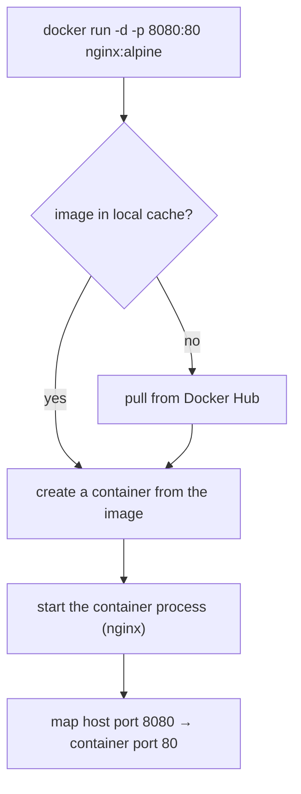

# Your First Container — Step by Step

## 1. Pull an Image

```bash
docker pull nginx:alpine
```

This downloads the `nginx` image tagged `alpine` from Docker Hub.  
`alpine` is a tiny Linux distro — keeps the image small.

## 2. Run a Container

```bash
docker run -d -p 8080:80 --name my-nginx nginx:alpine
```

| Flag | Meaning |
|---|---|
| `-d` | Detached mode (runs in background) |
| `-p 8080:80` | Map host port 8080 → container port 80 |
| `--name my-nginx` | Give the container a friendly name |

Open `http://localhost:8080` — you should see the Nginx welcome page.

## 3. Inspect the Running Container

```bash
docker ps                        # list running containers
docker logs my-nginx             # view stdout/stderr logs
docker inspect my-nginx          # full JSON metadata
docker stats my-nginx            # live CPU/memory usage
```

## 4. Execute a Command Inside

```bash
docker exec -it my-nginx sh      # open an interactive shell
```

Inside the shell:
```sh
cat /etc/nginx/nginx.conf        # view nginx config
exit
```

## 5. Stop and Remove

```bash
docker stop my-nginx
docker rm my-nginx
```

Or combine: `docker rm -f my-nginx` (force-stop then remove).

## 6. Clean Up the Image

```bash
docker rmi nginx:alpine
```

## One-Shot Containers

Use `--rm` to auto-remove the container after it exits:

```bash
docker run --rm alpine echo "Hello from Alpine"
docker run --rm -it ubuntu bash   # interactive throwaway shell
```

## What Just Happened?

The command `docker run -d -p 8080:80 nginx:alpine` breaks down as:

| Part | Meaning |
|---|---|
| `-d` | run in the background (detached) |
| `-p 8080:80` | port mapping (host:container) |
| `nginx:alpine` | image to use |

And here's what Docker does behind the scenes:


