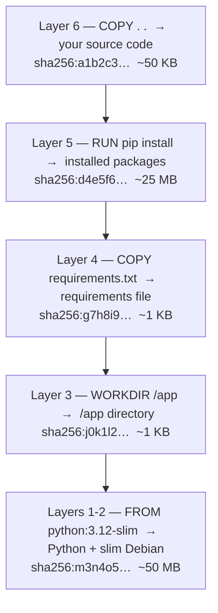
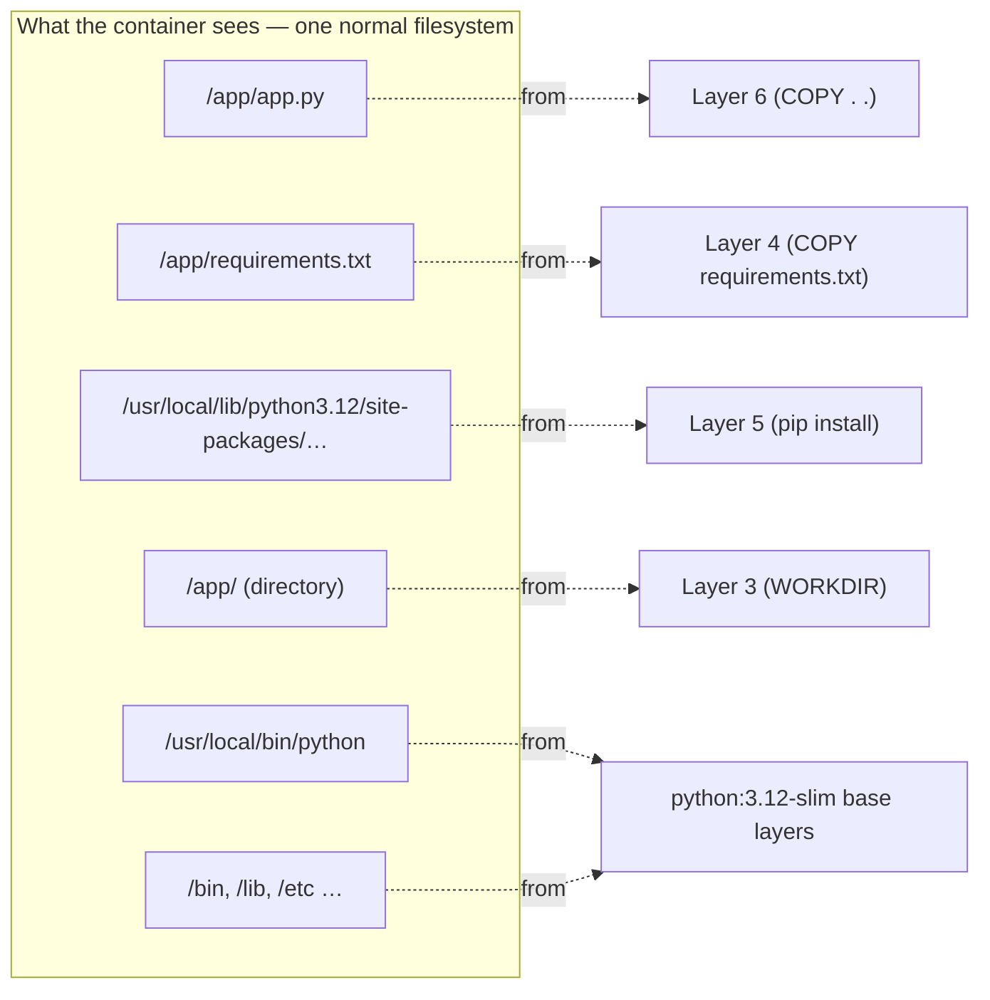
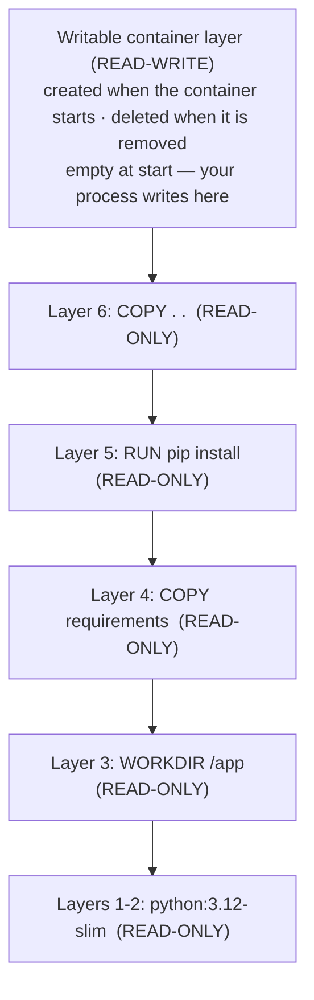
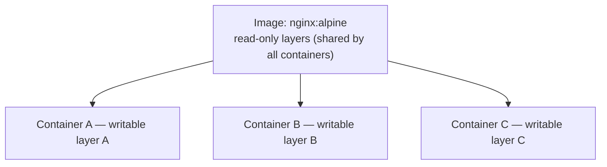
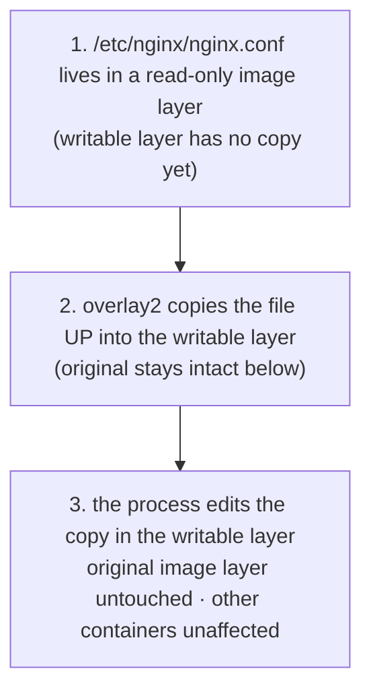
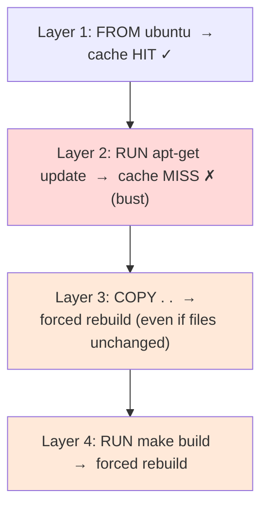
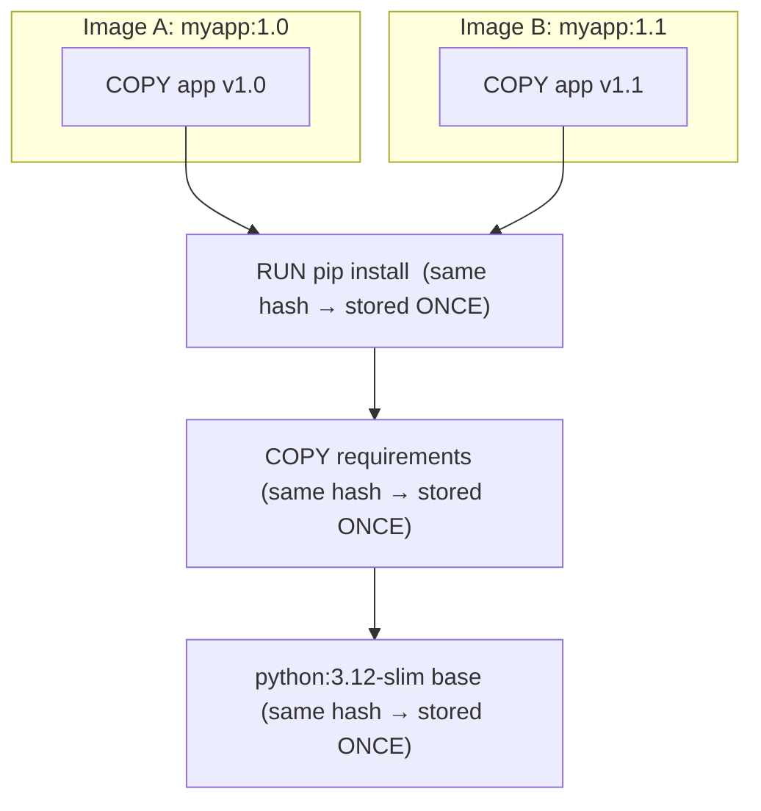

# Docker Image Layers — Complete Guide

> Understanding layers is the single most important concept for writing fast, small, efficient Docker images. Everything else — build caching, multi-stage builds, image size — follows from this.

---

## 1. The Analogy: Layers Are Like Git Commits

Think of a Docker image the same way you think of a Git repository.

In Git:
- Each **commit** records only what *changed* from the previous commit
- The full file state at any point is reconstructed by replaying commits in order
- Commits are immutable — you never rewrite history, you add on top

In Docker:
- Each **layer** records only what *changed* from the previous layer
- The full filesystem a container sees is constructed by stacking layers in order
- Layers are immutable — once created, a layer never changes

| Git history | Docker image |
|---|---|
| `commit abc: "add index.html"` | Layer 4: `COPY ./app /app` |
| `commit def: "install deps"` | Layer 3: `RUN pip install flask` |
| `commit ghi: "add Dockerfile"` | Layer 2: `RUN apt-get install python3` |
| `commit xyz: "initial ubuntu"` | Layer 1: `FROM ubuntu:22.04` |

Just like Git, the newest change sits on top and everything below it stays frozen.

---

## 2. How Dockerfile Instructions Become Layers

Not every Dockerfile instruction creates a layer. Only instructions that **change the filesystem** produce a new layer. The rest just attach *metadata* to the image (settings Docker remembers, but no files added):

| Instruction | Creates a layer? | Why |
|---|---|---|
| `FROM` | Yes (inherits base image layers) | Imports all layers from the base image |
| `RUN` | Yes | Executes a command; filesystem changes are captured |
| `COPY` | Yes | Copies files into the image |
| `ADD` | Yes | Same as COPY (plus tar extraction) |
| `ENV` | No | Stores metadata only |
| `ARG` | No | Build-time variable, no filesystem change |
| `EXPOSE` | No | Documentation only |
| `LABEL` | No | Metadata only |
| `CMD` | No | Sets default command, no filesystem change |
| `ENTRYPOINT` | No | Sets entrypoint, no filesystem change |
| `WORKDIR` | Yes (if dir doesn't exist) | Creates the directory |
| `USER` | No | Sets user metadata |
| `VOLUME` | No | Declares a mount point, no actual files |

### Example: Reading a Dockerfile as Layers

```dockerfile
FROM python:3.12-slim          # imports ~10 layers from python:3.12-slim image
WORKDIR /app                   # layer: creates /app directory
COPY requirements.txt .        # layer: adds requirements.txt
RUN pip install -r requirements.txt  # layer: installs packages into site-packages
COPY . .                       # layer: copies your source code
CMD ["python", "app.py"]       # no layer (metadata only)
```

Resulting image layer stack (newest on top, base at the bottom):



Total image size on disk: **~75 MB**.

---

## 3. How Layers Are Stored: The overlay2 Driver

On Linux, Docker uses the **overlay2** storage driver to merge all the layers into a single unified filesystem view. The container process sees one ordinary filesystem and has no idea it's actually built from stacked layers:



On disk (at `/var/lib/docker/overlay2/`), Docker keeps each layer in its own directory:

```
/var/lib/docker/overlay2/
├── a1b2c3.../           ← Layer 6 diff directory
│   └── diff/
│       └── app/
│           └── app.py
├── d4e5f6.../           ← Layer 5 diff directory
│   └── diff/
│       └── usr/local/lib/python3.12/site-packages/...
├── g7h8i9.../           ← Layer 4 diff directory
│   └── diff/
│       └── app/
│           └── requirements.txt
...
```

When Docker starts the container, overlay2 stacks all those `diff/` directories and presents them as a single merged view — that merged view is the filesystem the container process actually uses.

---

## 4. The Writable Container Layer

When you start a container from an image, Docker adds one more layer on top of all the image layers: the **writable container layer** (also called the "container layer" or "thin writable layer").



Key facts about the writable layer:
- All image layers underneath it are **read-only** — the container process cannot modify them
- Any file the process writes (logs, temp files, database data) goes into the writable layer
- When the container is removed (`docker rm`), the writable layer is **permanently deleted**
- Multiple containers started from the same image each get their own writable layer, but **share all the read-only image layers** — no duplication



This is why you can run 100 containers from the same image without using 100× the disk space — only the (usually tiny) writable layers differ.

---

## 5. Copy-on-Write (CoW)

What happens when a container process tries to **modify** a file that lives in a read-only image layer?

Docker uses **copy-on-write**: before the process can write to the file, the storage driver copies it *up* from the read-only layer into the writable container layer. The process then edits the copy. The original layer is never touched.



CoW has a performance cost: the **first** write to any image-layer file requires a full file copy. For large files (databases, large logs), this overhead is exactly why you should **always use volumes** for write-heavy paths rather than letting the container write into its writable layer. (See [volumes](../04-volumes/README.md).)

---

## 6. Layer Caching — The Build Cache

Every time you run `docker build`, Docker checks whether it can **reuse a cached layer** instead of re-running the instruction. This is the most impactful optimization in day-to-day Docker use — it's the difference between a 2-second build and a 2-minute one.

### Cache Rules

Docker invalidates a layer's cache (and all layers after it) when:

1. The instruction itself changes
2. For `COPY`/`ADD`: any file in the source path has changed
3. For `RUN`: the cache from the previous layer was invalidated (a cache bust propagates forward)

Here's the same Dockerfile across two builds, where only `app.py` changed the second time:

| Instruction | First build | Second build (only `app.py` changed) |
|---|---|---|
| `FROM python:3.12-slim` | CACHE HIT ✓ | CACHE HIT ✓ |
| `WORKDIR /app` | CACHE HIT ✓ | CACHE HIT ✓ |
| `COPY requirements.txt .` | CACHE HIT ✓ | CACHE HIT ✓ — requirements unchanged |
| `RUN pip install -r req.txt` | CACHE HIT ✓ | CACHE HIT ✓ — **not re-run!** |
| `COPY . .` | RUN (first time) | CACHE MISS ✗ — `app.py` changed |
| `CMD ["python","app.py"]` | (metadata) | (metadata) |

Because `COPY requirements.txt` and `RUN pip install` sit *above* `COPY . .`, they are **not invalidated** when only source code changes. The expensive `pip install` is skipped on every subsequent build.

### Cache Invalidation Propagates Forward

If a layer's cache is invalidated, **every layer after it must also be rebuilt**, even if those instructions haven't changed:



This is why **instruction order matters enormously**.

### The Golden Rule: Least-Changing Instructions First

```dockerfile
# BAD — copies all source first, invalidating pip install on every code change
FROM python:3.12-slim
WORKDIR /app
COPY . .                          # ← changes every time any file changes
RUN pip install -r requirements.txt  # ← re-runs on every build

# GOOD — dependencies installed before source is copied
FROM python:3.12-slim
WORKDIR /app
COPY requirements.txt .           # ← only changes when dependencies change
RUN pip install -r requirements.txt  # ← cached until requirements change
COPY . .                          # ← changes frequently, but comes after the slow step
```

The same pattern applies to every language — copy the *dependency manifest* first, install, then copy the rest of the source:

```dockerfile
# Node.js
COPY package*.json ./
RUN npm ci
COPY . .

# Go
COPY go.mod go.sum ./
RUN go mod download
COPY . .

# Java (Maven)
COPY pom.xml .
RUN mvn dependency:go-offline
COPY src ./src
```

---

## 7. Layer Sharing Between Images

Because layers are identified by a content hash (SHA256), identical layers are **stored once on disk** and shared across all images that use them.



Only the top `COPY app` layer differs between the two images; everything below is shared.

| | Disk usage |
|---|---|
| Without sharing | 75 MB + 75 MB = **150 MB** |
| With sharing | 75 MB + ~50 KB (only the new top layer) = **~75 MB** |

This sharing also applies to `docker pull` — layers already present locally are never re-downloaded:

```
$ docker pull myapp:1.1
Layer sha256:abc123: Already exists   ← python base (shared)
Layer sha256:def456: Already exists   ← pip install (shared)
Layer sha256:ghi789: Already exists   ← requirements (shared)
Layer sha256:xyz999: Pull complete    ← only new app code downloaded
```

---

## 8. Inspecting Layers

### docker history — see every layer in an image

```bash
docker history python:3.12-slim
```

```
IMAGE          CREATED       CREATED BY                                SIZE
3ac0c0e5734e   2 weeks ago   CMD ["python3"]                           0B
<missing>      2 weeks ago   RUN /bin/sh -c set -eux; ...pip...        14.2MB
<missing>      2 weeks ago   ENV PYTHON_VERSION=3.12.3                 0B
<missing>      2 weeks ago   RUN /bin/sh -c apt-get update && ...      29.8MB
<missing>      2 weeks ago   FROM scratch                              0B
```

`0B` layers are metadata instructions (CMD, ENV, LABEL). Non-zero sizes are real filesystem layers.

### docker inspect — layer IDs and full metadata

```bash
docker inspect python:3.12-slim | jq '.[0].RootFS'
```

```json
{
  "Type": "layers",
  "Layers": [
    "sha256:f1417ff83b319...",
    "sha256:a8903d590159b...",
    "sha256:c9d6d2d4cc5c4..."
  ]
}
```

### Dive — interactive layer explorer (third-party tool)

```bash
# Install
brew install dive          # macOS
# or
go install github.com/wagoodman/dive@latest

# Use
dive myapp:latest
```

Dive shows exactly which files each layer adds, modifies, or deletes — the most useful tool for diagnosing bloated images.

---

## 9. Dangling Layers and Cleanup

When you rebuild an image with the same tag, the old layers become **dangling** — no tag points to them anymore, but they still take up disk space.

```bash
docker images -a                        # show all layers incl. intermediate
docker images --filter dangling=true    # show untagged dangling images
docker image prune                      # remove dangling images
docker builder prune                    # remove unused build cache
docker system df                        # see total layer cache size
```

---

## 10. Best Practices Summary

| Do ✅ | Don't ❌ |
|---|---|
| Put slow/stable steps early (deps before source) | Put `COPY . .` before `RUN install` |
| Combine related `RUN` commands: `RUN apt-get update && install && rm -rf /var/lib/apt/lists/*` | Create one `RUN` per `apt-get install` (doubles the layer count) |
| Remove build artefacts in the **same** `RUN` step to keep the layer small | Install `gcc` in one layer and `rm` it in a later one — too late, it's already baked into the earlier layer |
| Use multi-stage builds to exclude build tools from the final image | Ship your compiler and build tools in the production image |
| Use `.dockerignore` to exclude `node_modules`, `.git`, `dist/`, `*.log` | `COPY . .` everything, bloating the build context |
| Pin base image versions: `FROM python:3.12-slim` | `FROM python:latest` — unpredictable, breaks on new releases |

### Why "remove it later" doesn't work

A common beginner mistake is installing a tool in one layer and deleting it in a later one. It doesn't shrink the image, because the tool is already permanently stored in the earlier layer — the delete just *hides* it in the merged view:

```dockerfile
# BAD: 3 layers, gcc stays baked into layer 2 forever
RUN apt-get update
RUN apt-get install -y gcc
RUN gcc -o /app/server server.c

# GOOD: 1 layer, apt cache cleaned, gcc removed within the same layer
RUN apt-get update \
    && apt-get install -y --no-install-recommends gcc \
    && gcc -o /app/server server.c \
    && apt-get purge -y gcc \
    && rm -rf /var/lib/apt/lists/*

# BEST for compiled languages: multi-stage build
FROM gcc:13 AS builder
COPY server.c .
RUN gcc -o /server server.c

FROM debian:bookworm-slim
COPY --from=builder /server /server   # only the binary, no gcc
CMD ["/server"]
```

---

## Related

- [Dockerfile reference](./dockerfile-reference.md) — every instruction explained
- [Volumes — Union filesystem](../04-volumes/README.md) — how the writable layer fits into the storage model
- [Multi-stage builds in cheatsheet](../cheatsheets/dockerfile.md)
