# Virtualization vs Containers — Deep Dive

> This is the theory behind **why Docker exists**. Understanding it will make every Docker concept click faster.

---

## 1. The Problem Docker Solves

Before containers, the classic developer frustration was:

> **Developer:** "It works on my machine!"
> **Ops team:** "Well, it doesn't work in production!"

Why did this happen? The app worked on the developer's laptop because that laptop had a very specific setup:

- Python 3.9 (the server had 3.7)
- a particular version of every library
- an environment variable set in the developer's shell
- a config file sitting at a path that only existed on their machine

Move the same code to a server with even *one* of those things different, and it breaks. The code didn't change — the **environment around the code** did.

**The fix is to package the app *together with everything it needs*** — the language runtime, the libraries, the config, the file layout — so the bundle behaves identically everywhere.

Two technologies solve this in different ways:

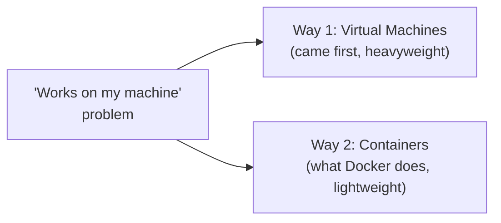

The rest of this document explains both, and *why containers won* for most modern software.

---

## 2. What is a Virtual Machine?

A **Virtual Machine (VM)** is a software emulation of a complete computer. It runs an entire operating system (called the **Guest OS**) on top of your real hardware (the **Host**).

The key idea: a VM pretends to *be* a physical machine. The Guest OS inside it has no idea it isn't running on real hardware — it boots, loads drivers, and manages "its own" CPU and disk exactly as if it owned the whole box.

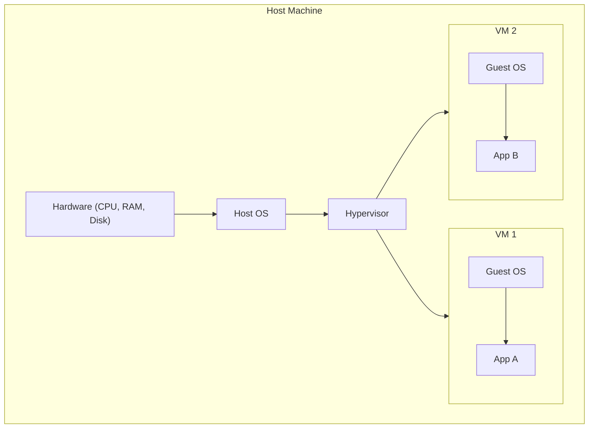

Each VM is **completely independent** — its own OS, its own kernel, its own drivers. They share nothing with each other or the host at the OS level. That independence is a VM's biggest strength (strong isolation) *and* its biggest cost (a full OS per VM).

---

## 3. What is a Hypervisor?

A **hypervisor** (also called a Virtual Machine Monitor, or VMM) is the software that **creates and manages VMs**. It sits between the hardware and the guest operating systems and controls how each VM accesses the physical hardware (CPU, RAM, disk, network).

Think of a hypervisor as a **traffic cop for hardware resources** — it decides which VM gets CPU time, how much RAM each gets, and prevents them from interfering with each other.

### How a Hypervisor Works

One physical machine (say 8 CPU cores, 32 GB RAM, 1 TB disk) is *sliced* into several virtual machines, each given a fixed portion:

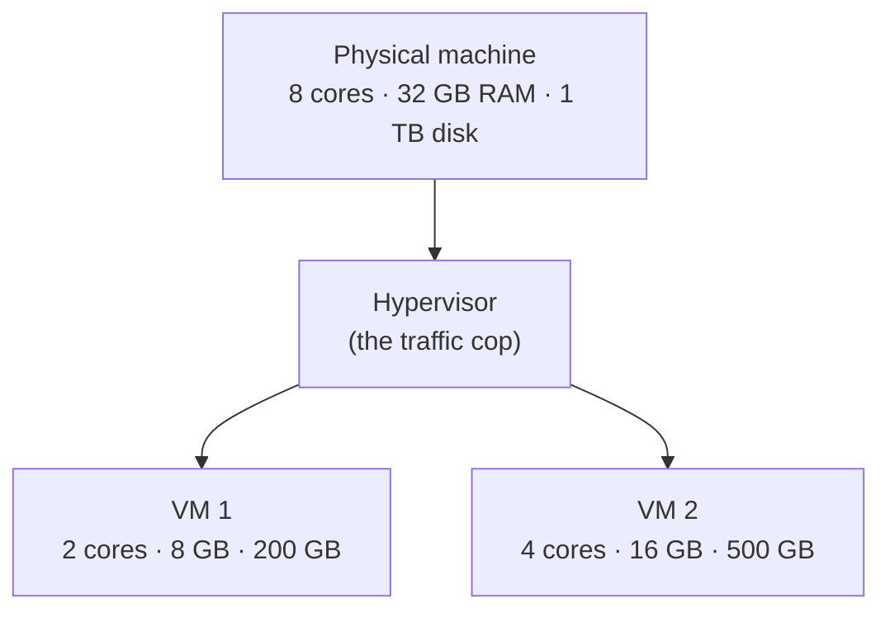

The hypervisor uses **hardware virtualization extensions** (Intel VT-x, AMD-V) built into modern CPUs to do this efficiently — so the Guest OS runs *almost* as fast as if it had the hardware to itself.

---

## 4. Types of Hypervisors

### Type 1 — Bare-Metal Hypervisor

Runs **directly on the hardware** — no host OS in between. The hypervisor *is* the operating system of the machine.

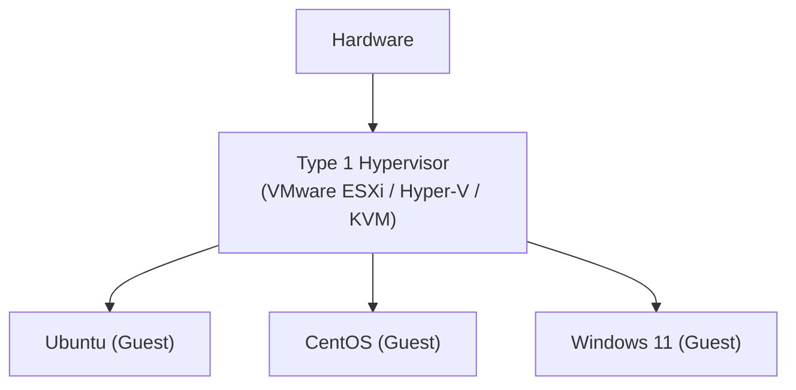

**Examples:**
- **VMware ESXi** — used in enterprise data centers
- **Microsoft Hyper-V** — used in Windows Server, Azure
- **KVM** — built into the Linux kernel, used by AWS under the hood
- **Xen** — used by older AWS EC2 instances

**Characteristics:**
- Highest performance (no host OS overhead)
- Enterprise-grade, production use
- What cloud providers (AWS, Azure, GCP) run in their data centers
- Direct access to hardware resources

**Real-world analogy:** A hotel where the building *is* the hotel management system — no separate manager's office, management is baked into the walls.

---

### Type 2 — Hosted Hypervisor

Runs **on top of a host OS** — the host OS boots first, then you launch the hypervisor as a regular application.

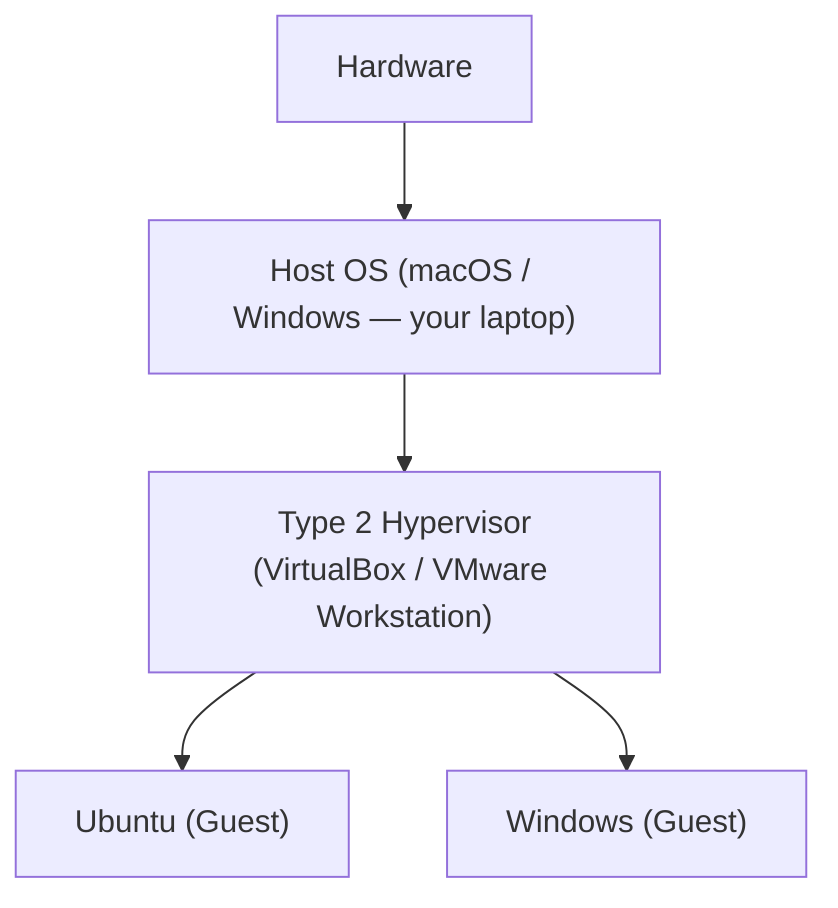

**Examples:**
- **VirtualBox** — free, open source, cross-platform
- **VMware Workstation / Fusion** — commercial, high performance
- **Parallels Desktop** — macOS-specific, excellent Apple Silicon support
- **QEMU** — open source emulator (also used in KVM mode)

**Characteristics:**
- Easier to install (just another app)
- Some performance overhead (requests pass through the host OS)
- Great for development and testing on a laptop
- Slower than Type 1

**Real-world analogy:** A hotel that rents a few floors inside a normal office building (the host OS). The building was there first; the hotel is just a tenant.

---

### Type 1 vs Type 2 — Side by Side

| Feature | Type 1 (Bare Metal) | Type 2 (Hosted) |
|---|---|---|
| Runs on | Hardware directly | A host OS |
| Performance | ★★★★★ (best) | ★★★☆☆ |
| Use case | Data centers, cloud | Developer laptops |
| Examples | ESXi, Hyper-V, KVM | VirtualBox, Parallels |
| Install complexity | High (needs a server) | Low (just an app) |
| Cost | Enterprise pricing | Free (VirtualBox) |

---

## 5. The Problem with VMs

VMs solved the "works on my machine" problem, but introduced new ones. The root cause of all of them is the same: **every VM carries a full operating system.**

| VM downside | Why it hurts |
|---|---|
| Each VM = a full OS | 1–20 GB of disk *per VM*, before your app is even added |
| Slow to boot | Minutes — the whole OS has to start up |
| High RAM usage | The OS alone reserves ~512 MB+ before your app runs |
| Hard to scale | Spinning up a new instance takes minutes, not seconds |
| Heavy to move | Images are gigabytes to copy or transfer |

If you have 50 microservices and run each in its own VM, that's **50 full OS installs** — hundreds of gigabytes of disk and RAM spent on operating systems you never actually wanted, just to run 50 small apps.

---

## 6. How Containers Work Differently

Containers use a completely different approach: **OS-level virtualization**.

Instead of emulating hardware and booting a full OS, containers use **features built into the Linux kernel** to create isolated process groups. Every container *shares the host's single kernel*, but each one is fenced off so it can't see or affect the others.

The difference in one sentence: **a VM virtualizes the hardware; a container virtualizes the operating system.**

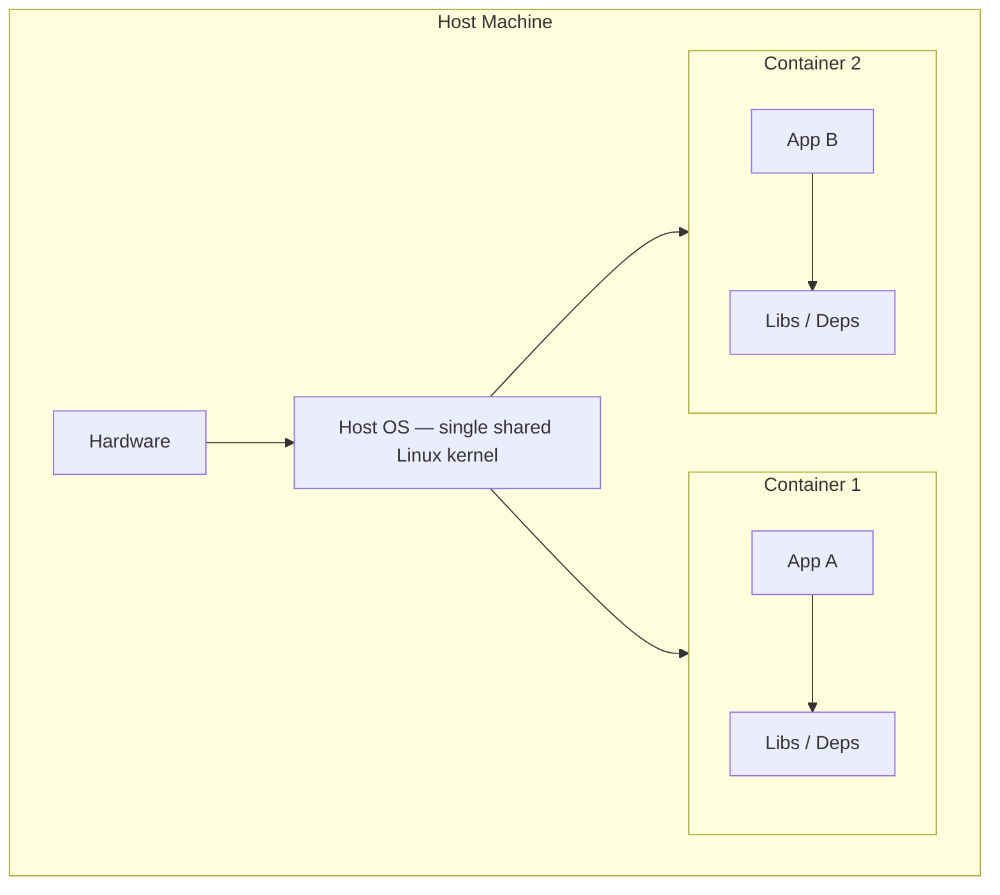

Notice what's *missing* compared to the VM diagram: there's no Guest OS inside each container. That's the whole saving. A container ships only your app plus its libraries — often just a few megabytes.

### The Two Linux Features That Make This Possible

**Namespaces** — give each container its own private *view* of the system. A process inside the container sees only what its namespaces allow:

| Namespace | What it isolates |
|---|---|
| `pid` | Process IDs (the container has its own PID 1) |
| `net` | Network interfaces, IP addresses, ports |
| `mnt` | Filesystem mount points |
| `uts` | Hostname and domain name |
| `ipc` | Inter-process communication |
| `user` | User and group IDs |
| `cgroup` | Resource control groups (Linux 4.6+) |

**Example:** run `ps aux` inside a container and you might see only one or two processes — even though the host is running hundreds. The `pid` namespace hides everything outside the container.

**cgroups (Control Groups)** — *limit and track* how much of each resource a container may use:

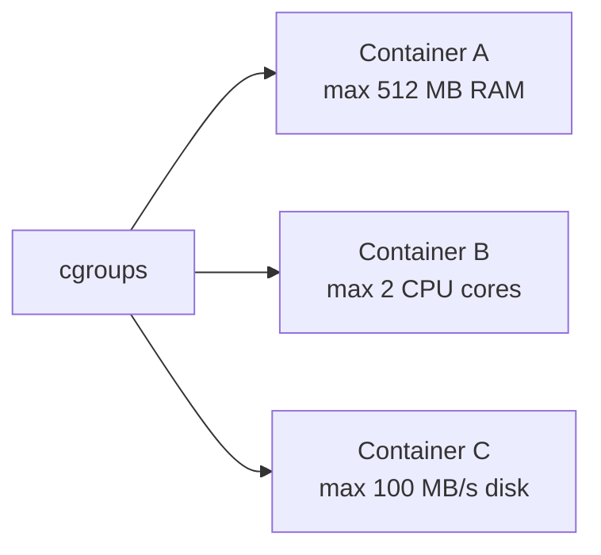

Put them together and the picture is clear: **namespaces make each container *think it's alone* on the machine, while cgroups stop any one container from hogging all the host's resources.**

---

## 7. VM vs Container — Direct Comparison

| | Virtual Machine | Container |
|---|---|---|
| Isolation | Hardware-level | OS process-level |
| OS per unit | Full OS (1–20 GB) | None (shares the host kernel) |
| Startup time | Minutes | Milliseconds |
| Size | Gigabytes | Megabytes |
| Performance | Near-native (Type 1) | Native (no overhead) |
| Portability | Heavy (large images) | Light (small images) |
| Density | ~10s per host | ~100s per host |
| Security | Strong (kernel isolated) | Good (shared kernel) |
| Use case | Long-running servers | Microservices, apps |
| Immutability | Hard | Built-in |

### When to use VMs
- Running a different operating system (a Windows app on a Linux host)
- Strong security isolation requirements (finance, healthcare)
- Legacy applications that need a full OS environment
- Database servers where you want OS-level control

### When to use Containers
- Microservices architectures
- CI/CD pipelines (fast and disposable)
- Scalable web applications
- Development environments
- Anything you want to "deploy once, run anywhere"

### When to use BOTH

In practice, cloud environments use **both** — containers *inside* VMs:

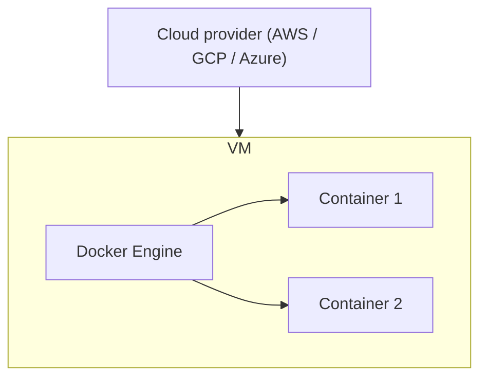

Your containers run inside a VM, which runs on a hypervisor, in a data center. You get the best of both: **cloud elasticity** from the VM and **app portability** from the containers.

---

## 8. Docker's Architecture

Docker is not a single program that "runs containers" — it's a **client-server system**. The command you type (`docker`) is just a thin client that sends instructions to a background service that does the real work.

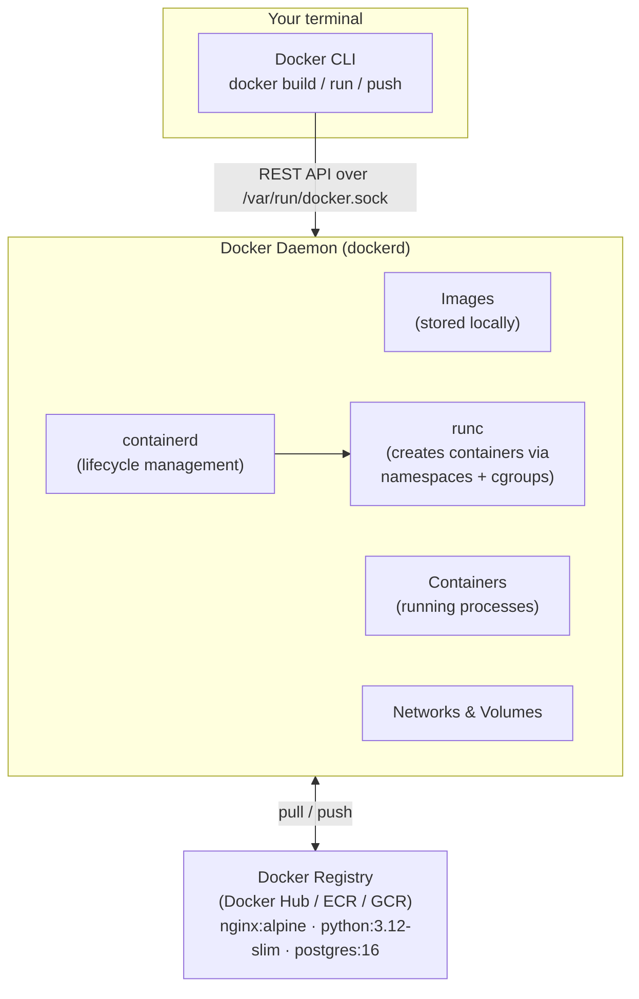

**Key components:**
- **Docker CLI** — the `docker` command you type
- **Docker Daemon (dockerd)** — the background service that does the actual work
- **containerd** — manages the container lifecycle (start, stop, pull images)
- **runc** — the low-level tool that calls Linux kernel APIs (namespaces, cgroups) to actually create the container
- **Registry** — remote storage for images

### What happens when you run `docker run nginx`

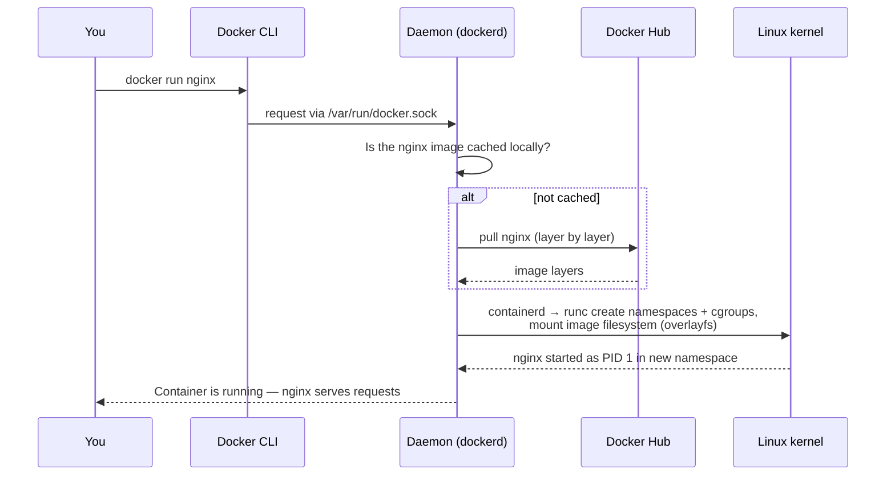

The takeaway: by the time a container starts, the kernel has done all the real isolation work (namespaces + cgroups). Docker is the friendly tooling layer on top.

---

## 9. Image Layers — How Docker Stays Small

Docker images are built from **layers**. Each Dockerfile instruction that changes the filesystem creates a new layer, and layers are **cached and shared** between images.

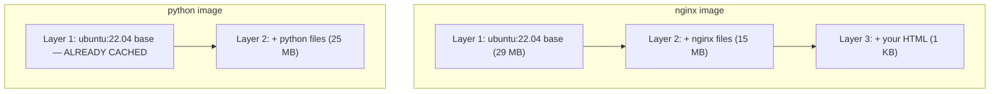

Because both images start `FROM ubuntu:22.04`, that base layer is **downloaded once and reused**. Building the second image only pulls the 25 MB of python files — the 29 MB base is already on disk.

This is exactly why `docker pull` prints **"Already exists"** for many layers: they're shared, not re-downloaded.

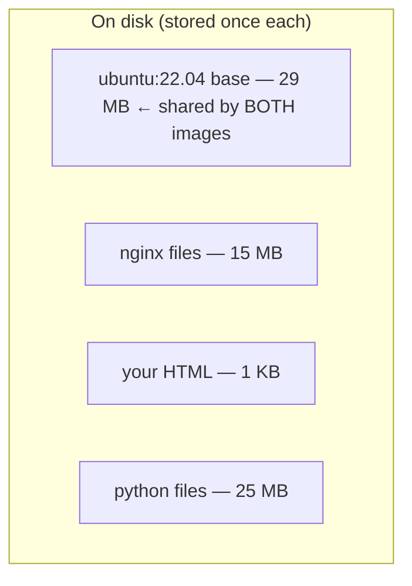

Stored total: **~70 MB**, not 44 MB + 54 MB = 98 MB. The shared base layer is only counted once. (See [image-layers.md](image-layers.md) for the full deep dive.)

---

## 10. Summary

| | Hypervisor (Type 1) | Hypervisor (Type 2) | Container (Docker) |
|---|---|---|---|
| Example | VMware ESXi, Hyper-V, KVM/Xen | VirtualBox, VMware Workstation, Parallels | Docker Engine (containerd + runc) |
| Runs on | Bare hardware | Your laptop's OS | Inside any OS |
| OS per unit | Full OS per VM | Full OS per VM | Shared kernel |
| Size | GBs per VM | GBs per VM | MBs per container |
| Startup | Minutes | Minutes | Milliseconds |
| Isolation | Hardware | Hardware | Process (namespaces + cgroups) |

**The mental model to keep:**
- **VM** = your own house — own land, own walls, own utilities. Private, but expensive to build and maintain.
- **Container** = an apartment — shared building, pipes, and electricity, but your own private space inside. Cheap and fast to move into.
- **Hypervisor** = the property management company that hands out the land and the houses.
