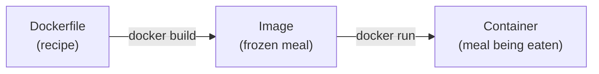
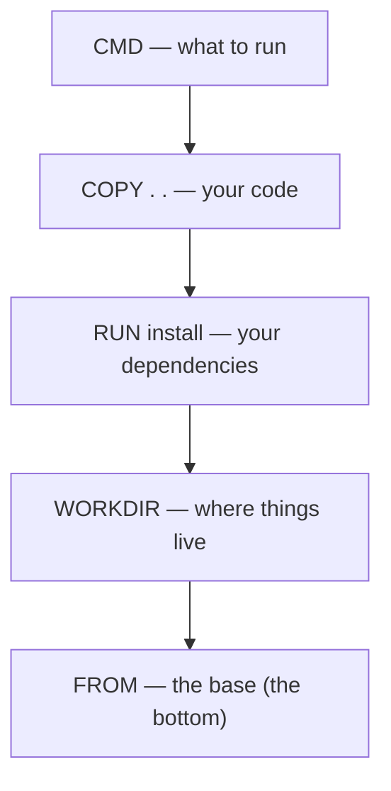

# Writing a Dockerfile — Step by Step

This guide walks you through writing a Dockerfile **from a blank file to a working image**, one decision at a time. For each step you'll see *what* you write, *what it does*, and *why* you do it that way. Plain language, no assumptions.

> Already know the basics and just want a lookup table of instructions? See [dockerfile-reference.md](./dockerfile-reference.md). Want to understand why each line creates a layer? See [image-layers.md](./image-layers.md).

---

## First: What is a Dockerfile, really?

A Dockerfile is a **recipe**. It's a plain text file (named exactly `Dockerfile`, no extension) that lists the steps Docker should follow to build an **image**. Docker reads it **top to bottom**, runs each step, and saves the result.



- **Image** = the packaged result (your app + everything it needs to run).
- **Container** = a running copy of that image.

Each line in a Dockerfile is called an **instruction**. Instructions are usually written in UPPERCASE (a convention, not a rule) followed by their arguments:

```dockerfile
INSTRUCTION arguments
```

Every meaningful instruction adds a **layer** — a saved snapshot of the change it made. Layers get cached, which is why the *order* of your instructions matters a lot (more on that below).

---

## The mental model: build top-to-bottom

When you run `docker build`, Docker:

1. Reads the **first** instruction, does it, saves a layer.
2. Reads the **next** instruction, does it, saves another layer **on top**.
3. Repeats until the file ends.
4. The stack of layers = your final image.



(Top = last instruction, bottom = the base image. Each instruction stacks a layer on the one below it.)

Keep this picture in mind — it explains almost every "best practice" later.

---

## Step 1 — Choose a base image with `FROM`

**Every Dockerfile starts with `FROM`.** You are never starting from nothing — you start from an existing image that already has an operating system and (often) a language runtime installed.

```dockerfile
FROM python:3.12-slim
```

**What this does:** downloads the `python` image, version `3.12-slim`, and uses it as your starting point. Now Python 3.12 is already installed inside.

**Why a base image?** Installing an OS and a language from scratch every time would be slow and error-prone. The community maintains tested base images, so you build *on top* of them.

### How to read an image name

In `python:3.12-slim`:

- `python` — the **repository** (the software)
- `3.12-slim` — the **tag** (the version / variant)

### Which tag (variant) should you pick?

| Tag style | Size | When to use |
|---|---|---|
| `python:3.12` | Large (~1 GB) | You need lots of system tools; quick experiments |
| `python:3.12-slim` | Small (~150 MB) | **Most apps** — good default |
| `python:3.12-alpine` | Tiny (~50 MB) | Smallest size, but uses musl libc — some packages break |
| `python:latest` | Varies | ❌ Avoid — "latest" changes over time and breaks reproducibility |

**Rule of thumb:** pick a **specific version** (so your build is the same next month) and prefer **`-slim`** unless you have a reason not to.

> Why not `latest`? Because `latest` today might be 3.12 and next month 3.14. A build that worked could suddenly fail. Pinning a version = predictable builds.

---

## Step 2 — Set the working directory with `WORKDIR`

```dockerfile
WORKDIR /app
```

**What this does:** creates the folder `/app` inside the image and `cd`s into it. Every instruction after this runs *from* `/app`.

**Why:** without it, your files could land anywhere (`/`, `/root`, etc.) and your commands would need full paths. `WORKDIR` gives your app a clean, predictable home. `/app` is just a common convention — any path works.

> Don't write `RUN mkdir /app && cd /app`. `cd` only lasts for that one `RUN` and is forgotten afterward. `WORKDIR` is the correct, persistent way.

---

## Step 3 — Copy dependency files FIRST with `COPY`

This is the step beginners get wrong, and the reason for it is the single most useful Docker concept to understand.

```dockerfile
COPY requirements.txt .
```

**What this does:** copies `requirements.txt` from your computer (the "build context") into the current folder inside the image (`/app`, because of `WORKDIR`). The `.` means "here".

**Why copy *only* this one file now, instead of all your code?** Because of the **build cache**.

### The caching trick (the "why" behind the ordering)

Docker caches each layer. When you rebuild, Docker reuses a cached layer **as long as nothing it depends on changed**. The moment one layer changes, *every layer after it* is rebuilt.

Your dependencies change **rarely**. Your source code changes **constantly**. So you put the slow, rarely-changing step (installing dependencies) *before* the fast, always-changing step (copying code):

```
COPY requirements.txt .   ← changes rarely  → install layer stays cached
RUN pip install ...       ← the slow step   → reused on most builds 🎉
COPY . .                  ← changes often   → only this re-runs
```

If you instead did `COPY . .` first, then *every* code edit would invalidate the install layer and reinstall everything from scratch — every single build. Slow and wasteful.

> **Build context:** when you run `docker build .`, that `.` is the folder sent to Docker. `COPY` can only copy files from inside this context. Use a `.dockerignore` file (Step 8) to keep junk out of it.

### `COPY` vs `ADD`

| | `COPY` | `ADD` |
|---|---|---|
| Copies files/folders | ✅ | ✅ |
| Auto-extracts `.tar` archives | ❌ | ✅ |
| Can download from a URL | ❌ | ✅ |

**Use `COPY`** almost always — it does exactly what it says. Only reach for `ADD` when you specifically need tar extraction.

---

## Step 4 — Install dependencies with `RUN`

```dockerfile
RUN pip install --no-cache-dir -r requirements.txt
```

**What this does:** runs a command *during the build* and saves the result as a layer. Here it installs your Python packages into the image.

**Why `--no-cache-dir`?** pip normally keeps a download cache. Inside an image that cache is dead weight you'll never reuse — it just makes the image bigger. Removing it keeps the image small.

### `RUN` and image size — chain your commands

Each `RUN` makes a new layer, and **a layer can only add, never shrink** the image. So if you install something in one `RUN` and delete it in the next, the deleted files *still live* in the earlier layer. The fix is to do install-and-cleanup in **one** `RUN`:

```dockerfile
# ✅ Good — install and clean up in ONE layer (Debian/Ubuntu example)
RUN apt-get update \
    && apt-get install -y --no-install-recommends curl \
    && rm -rf /var/lib/apt/lists/*
```

- `\` continues the command onto the next line (readability).
- `&&` means "and then, only if the previous part succeeded".
- `rm -rf /var/lib/apt/lists/*` deletes the package-manager cache *in the same layer*, so it never bloats the image.

> Two forms exist: **shell form** `RUN apt-get update` (runs through `/bin/sh -c`) and **exec form** `RUN ["apt-get", "update"]`. For `RUN`, shell form is normal and convenient because you want `&&`, pipes, and variables.

---

## Step 5 — Copy the rest of your code with `COPY . .`

```dockerfile
COPY . .
```

**What this does:** now that dependencies are installed, copy everything else (your actual source code) into `/app`.

**Why now and not earlier?** Exactly the caching reason from Step 3 — code changes most often, so it goes near the bottom where re-running it is cheap and doesn't disturb the cached install layer above it.

---

## Step 6 — Configure with `ENV`, `ARG`, `EXPOSE`, `USER`

These are optional but common. Add the ones your app needs.

### `ENV` — runtime environment variables

```dockerfile
ENV APP_ENV=production \
    PORT=8080
```

Sets variables available **both during build and inside the running container**. Use for configuration your app reads from the environment. (Never bake secrets like passwords in here — they end up visible in the image. Pass those at run time instead.)

### `ARG` — build-time-only variables

```dockerfile
ARG VERSION=1.0
RUN echo "Building version $VERSION"
```

Available **only during the build**, gone once the container runs. Set it at build time with `docker build --build-arg VERSION=2.0 .`. Use for things like a version number or a base-image tag.

> **`ARG` vs `ENV` in one line:** `ARG` = while building, `ENV` = while running.

### `EXPOSE` — document the port

```dockerfile
EXPOSE 8080
```

This is **documentation only**. It tells humans (and some tooling) "this app listens on 8080." It does **not** actually open the port. To make the port reachable you publish it when running: `docker run -p 8080:8080 my-app`.

### `USER` — stop running as root

```dockerfile
RUN useradd --create-home appuser
USER appuser
```

By default everything in a container runs as `root`, which is risky. After this line, the app runs as the limited `appuser`. **Do this for anything beyond local experiments** — if your app is ever compromised, the attacker isn't root.

---

## Step 7 — Define the start command: `CMD` vs `ENTRYPOINT`

This is the **last** step — it says what runs when someone starts a container from your image. Nothing here executes during the build; it only fires at `docker run`.

```dockerfile
CMD ["python", "app.py"]
```

**What this does:** sets the default command. When you `docker run my-app`, it runs `python app.py`.

### Always use the "exec form" (the JSON array)

```dockerfile
CMD ["python", "app.py"]      # ✅ exec form — preferred
CMD python app.py             # ⚠️ shell form — avoid
```

**Why exec form?** Shell form wraps your command in `/bin/sh -c`, which becomes process #1 (PID 1) instead of your app. That extra shell **doesn't pass along stop signals**, so `docker stop` can hang for 10 seconds and then kill your app abruptly. Exec form makes *your app* PID 1, so it shuts down cleanly.

### `CMD` vs `ENTRYPOINT` — which one?

| | `CMD` | `ENTRYPOINT` |
|---|---|---|
| Role | Default command, easily replaced | The fixed program that always runs |
| Overridden by | `docker run my-app <other command>` | only `docker run --entrypoint ...` |
| Best for | Simple "just run this" cases | A tool where users only pass *arguments* |

```dockerfile
# Most apps: just CMD
CMD ["python", "app.py"]

# A fixed program + default arguments (the powerful combo):
ENTRYPOINT ["gunicorn"]        # always runs gunicorn
CMD ["--workers", "4", "app:app"]   # default args, user can override just these
```

With the combo, `docker run my-app` runs `gunicorn --workers 4 app:app`, but `docker run my-app --workers 8 app:app` swaps in your args while still using gunicorn.

**Beginner advice:** start with just `CMD`. Reach for `ENTRYPOINT` only when you're building a tool where the program is fixed and only its arguments should change.

---

## Step 8 — Add a `.dockerignore`

Not part of the Dockerfile, but you should always create it alongside. It works like `.gitignore` and keeps unwanted files out of the **build context** (the stuff sent to Docker and copied by `COPY . .`).

```
# .dockerignore
.git/
node_modules/
__pycache__/
*.log
.env
```

**Why it matters:**
- **Faster builds** — Docker doesn't ship gigabytes of `.git` or `node_modules`.
- **Smaller, cleaner images** — junk doesn't sneak in via `COPY . .`.
- **Safety** — keeps secrets like `.env` from accidentally being baked into the image.

---

## The complete Dockerfile (everything together)

Here's every step combined into one well-ordered, commented file:

```dockerfile
# 1. Base image — pinned version, slim variant for small size
FROM python:3.12-slim

# 2. A predictable home for the app
WORKDIR /app

# 3. Copy ONLY dependency list first (so the install layer stays cached)
COPY requirements.txt .

# 4. Install deps; --no-cache-dir keeps the image small
RUN pip install --no-cache-dir -r requirements.txt

# 5. Now copy the rest of the source (changes often → goes last)
COPY . .

# 6. Configuration
ENV APP_ENV=production \
    PORT=8080
EXPOSE 8080

# Run as a non-root user for safety
RUN useradd --create-home appuser
USER appuser

# 7. What runs when the container starts (exec form!)
CMD ["python", "app.py"]
```

Build and run it:

```bash
docker build -t my-app .       # build the image, tag it "my-app"
docker run -p 8080:8080 my-app # run it, publish port 8080
```

- `docker build -t my-app .` — `-t` names the image, `.` is the build context (current folder).
- `docker run -p 8080:8080 my-app` — `-p host:container` connects your machine's port 8080 to the container's 8080.

---

## Bonus: Multi-stage builds (smaller, safer final images)

Sometimes you need heavy tools to *build* your app (compilers, dev packages) but **not** to *run* it. A multi-stage build uses a big image to build, then copies only the finished result into a small clean image. The build tools never reach your final image.

```dockerfile
# Stage 1: build (has all the heavy tooling)
FROM node:20-alpine AS builder
WORKDIR /app
COPY package*.json ./
RUN npm ci                 # installs everything, incl. dev tools
COPY . .
RUN npm run build          # produces /app/dist

# Stage 2: runtime (tiny — just a web server + the built files)
FROM nginx:alpine
COPY --from=builder /app/dist /usr/share/nginx/html
EXPOSE 80
CMD ["nginx", "-g", "daemon off;"]
```

- `AS builder` names the first stage.
- `COPY --from=builder ...` pulls files *out* of that stage into the final image.
- The final image has **no Node.js, no source code, no dev dependencies** — just nginx and the built site. Smaller and more secure.

See [image-layers.md](./image-layers.md) for the deeper "why" on layers and caching.

---

## Quick checklist for a good Dockerfile

- [ ] `FROM` a **pinned**, slim base image (not `latest`)
- [ ] `WORKDIR` set early
- [ ] Dependency files copied & installed **before** the app source (cache!)
- [ ] `RUN` commands chained with `&&` and caches cleaned in the same layer
- [ ] `COPY . .` near the bottom
- [ ] Runs as a **non-root** `USER`
- [ ] Start command in **exec form** (`["...", "..."]`)
- [ ] A `.dockerignore` file exists
- [ ] Multi-stage build used if you have heavy build tools

---

## Next

→ [dockerfile-reference.md](./dockerfile-reference.md) — the quick lookup version of every instruction
→ [image-layers.md](./image-layers.md) — how layers and the build cache actually work
→ [build-and-push-guide.md](./build-and-push-guide.md) — tag your image and push it to Docker Hub
