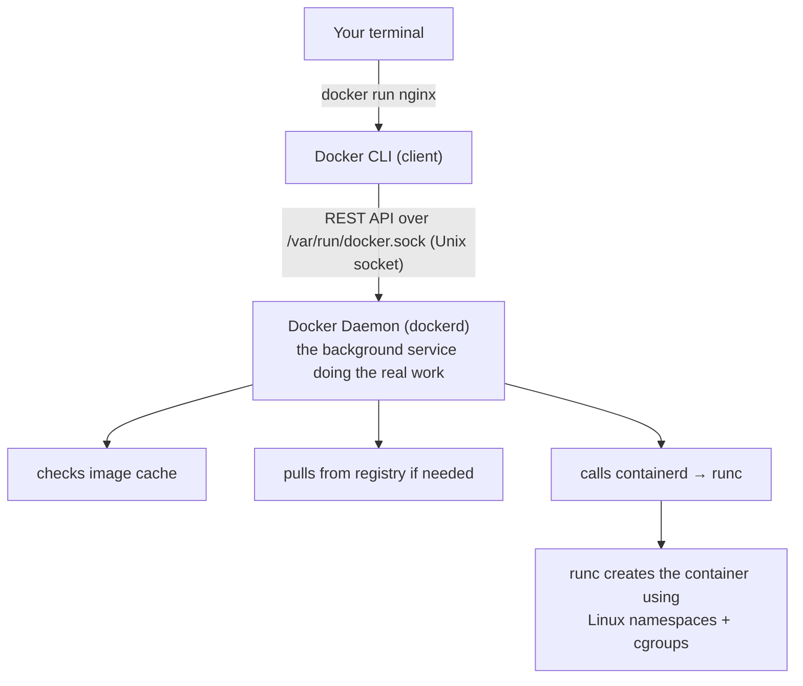
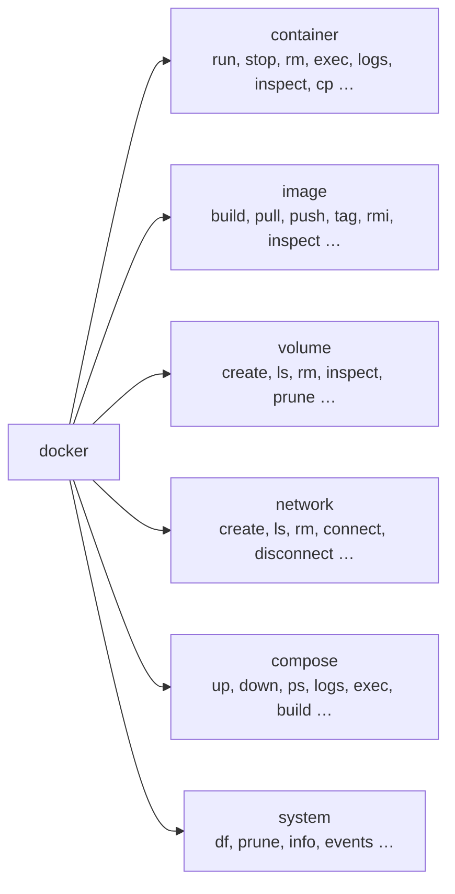

# 02 — Docker Commands

Essential Docker CLI commands grouped by what they operate on.

## How Commands Actually Work

Every `docker` command you type travels the same path:



The CLI itself does almost nothing — it's a thin wrapper that serialises your flags into an API call and prints the response. This is why `docker -H tcp://remote-host:2376 ps` lets you manage a remote Docker host from your local terminal.

> Background reading: [Docker architecture diagram](../01-basics/virtualization-vs-containers.md#8-dockers-architecture) in 01-basics covers this in detail.

## Command Map



Most top-level shortcuts exist for convenience:
`docker run` = `docker container run`, `docker ps` = `docker container ls`, etc.

## Files in This Section

- [container-commands.md](./container-commands.md) — lifecycle, exec, logs, copy
- [image-commands.md](./image-commands.md) — build, tag, push, pull, inspect
- [system-commands.md](./system-commands.md) — pruning, disk usage, info

## Quick Reference

```bash
# --- Containers ---
docker run -d -p 8080:80 --name web nginx:alpine   # run detached
docker ps                                           # list running
docker ps -a                                        # list all (incl. stopped)
docker stop web && docker rm web                   # stop then remove
docker rm -f web                                   # force remove

# --- Images ---
docker build -t myapp:1.0 .                        # build from Dockerfile
docker images                                      # list local images
docker rmi myapp:1.0                               # remove image
docker pull redis:7-alpine                         # pull from registry

# --- Logs & Inspection ---
docker logs -f web                                 # follow logs
docker inspect web                                 # full metadata
docker exec -it web sh                             # shell inside container

# --- System ---
docker system df                                   # disk usage
docker system prune -a --volumes                   # remove everything unused
```

## Next

→ [03 — Docker Compose](../03-docker-compose/)
