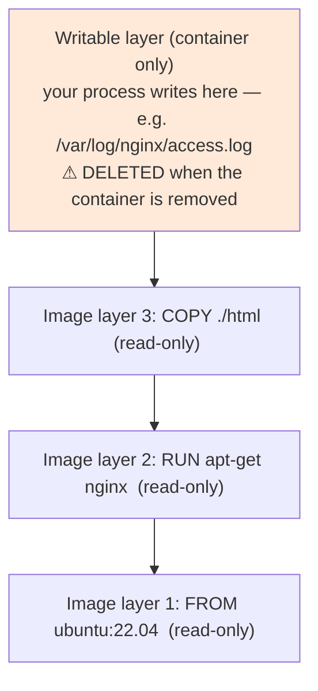
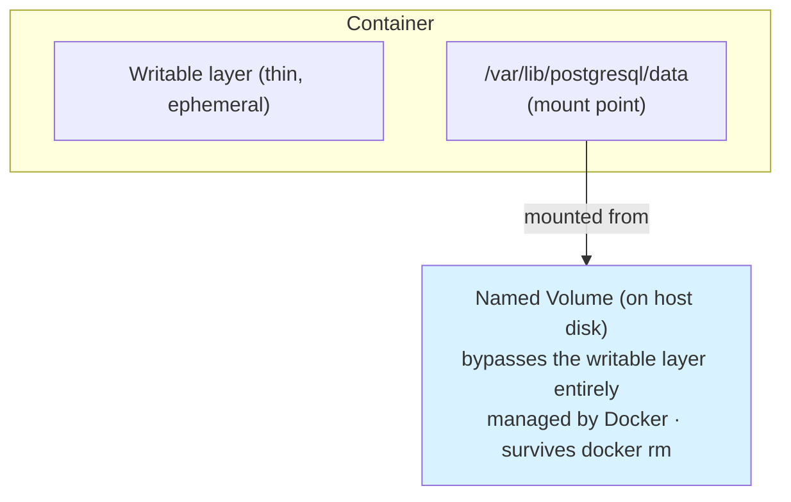
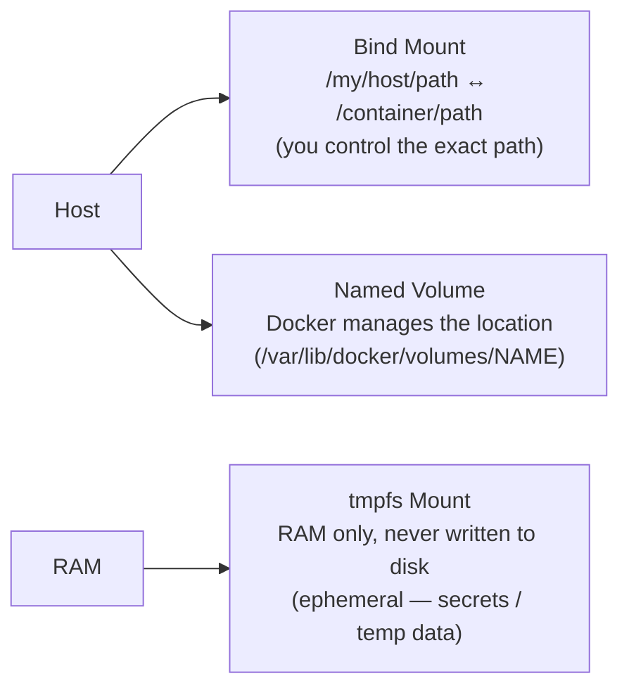

# 04 — Volumes

Containers are ephemeral — data written to a container's filesystem disappears when the container is removed. Volumes solve this.

## Why Containers Lose Data: The Union Filesystem

To understand *why* volumes are necessary, you need to understand how Docker builds a container's filesystem.

Docker images are made of **read-only layers** stacked on top of each other (one per Dockerfile instruction). When you start a container, Docker adds one extra **thin writable layer** on top:



This stack — what the running process sees as one filesystem — is managed by the **overlay2** storage driver (the default on Linux).

When you write a file that exists in a lower read-only layer, the driver **copies it up** to the writable layer before writing (copy-on-write). The original layer is untouched.

**The problem:** the writable layer is tied to the container's lifecycle. `docker rm` destroys it. This is why databases crash-loop on restart — their data files are gone.

**The solution:** mount storage that lives *outside* the container's writable layer — that's what volumes and bind mounts do.



Writes to `/var/lib/postgresql/data` go straight to the volume, not the throwaway writable layer — so the data survives even after the container is deleted.

> Related: [Image layers — full guide](../01-basics/image-layers.md) — covers overlay2, copy-on-write, and the writable layer in detail.

## Three Types of Mounts



| Mount type | Where it lives | Best for |
|---|---|---|
| **Bind mount** | A path you choose on the host | Development — live-reloading code, injecting config |
| **Named volume** | Docker-managed host storage | Databases and other persistent data |
| **tmpfs** | Host RAM (never on disk) | Secrets and temp data that must not persist |

## Named Volumes (recommended for databases)

```bash
docker volume create pgdata                          # create
docker run -v pgdata:/var/lib/postgresql/data postgres:16  # use
docker volume ls                                     # list
docker volume inspect pgdata                         # details
docker volume rm pgdata                              # remove (only if no container uses it)
docker volume prune                                  # remove all unused
```

Advantages over bind mounts:
- Docker manages the location — works the same on any OS
- Better performance on macOS/Windows (no file-sharing overhead)
- Can be pre-populated by the image

## Bind Mounts (recommended for development)

```bash
docker run -v $(pwd)/src:/app/src myapp          # absolute path required
docker run -v ./config:/etc/app/config:ro myapp  # read-only
```

Use for: live-reloading source code in dev, injecting config files.

## tmpfs Mounts (for secrets and temp data)

```bash
docker run --tmpfs /tmp:size=100m myapp
docker run --mount type=tmpfs,destination=/tmp,tmpfs-size=100m myapp
```

Data never touches disk. Good for: session data, secrets that shouldn't persist.

## Volume in Docker Compose

```yaml
services:
  db:
    image: postgres:16-alpine
    volumes:
      - pgdata:/var/lib/postgresql/data       # named volume
      - ./init.sql:/docker-entrypoint-initdb.d/init.sql:ro  # bind mount

volumes:
  pgdata:    # declares the named volume (Docker creates it if absent)
```

## Volume Backup and Restore

```bash
# Backup: run a temporary container to tar the volume contents
docker run --rm \
  -v pgdata:/data \
  -v $(pwd):/backup \
  alpine \
  tar czf /backup/pgdata-backup.tar.gz -C /data .

# Restore
docker run --rm \
  -v pgdata:/data \
  -v $(pwd):/backup \
  alpine \
  tar xzf /backup/pgdata-backup.tar.gz -C /data
```

## Files in This Section

- [volume-patterns.md](./volume-patterns.md) — common patterns and gotchas

## Next

→ [05 — Networking](../05-networking/)
