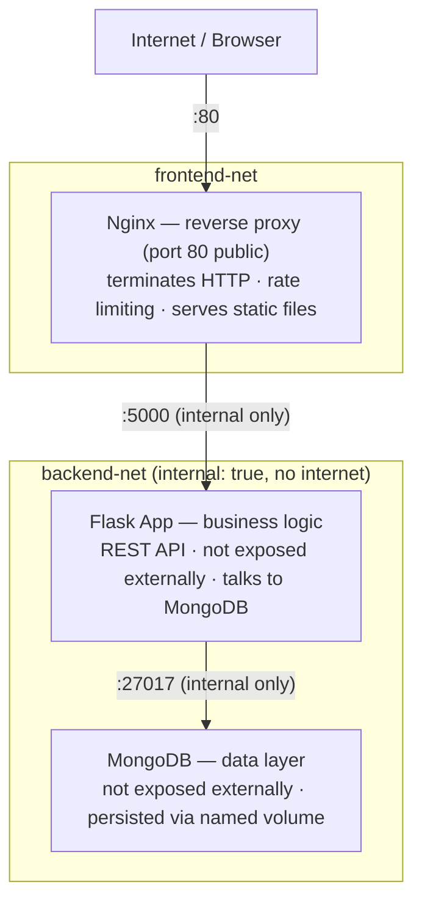

# Project 05 — Flask + MongoDB + Nginx

A production-pattern 3-tier web application: **Nginx** as a reverse proxy in front of a **Flask** REST API backed by **MongoDB**. This is one of the most common real-world stacks you'll encounter in DevOps work.

## Architecture



**Networks:**
- `frontend-net` — Nginx ↔ Flask
- `backend-net` — Flask ↔ MongoDB (`internal: true`, no internet access)

## What You'll Learn

- **Reverse proxy pattern** — Nginx in front of your app (industry standard)
- **Network segmentation** — frontend/backend networks with `internal: true`
- **MongoDB with Docker** — seeding data, named volumes, auth
- **Multi-stage Dockerfile** — small production Python image
- **Nginx upstream config** — proxying requests to a named container
- **Secret management** — credentials via `.env`, never hardcoded

## Quick Start

```bash
cp .env.example .env
make up

# Wait ~10 seconds for MongoDB to initialise, then:
curl http://localhost/api/health
curl http://localhost/api/books
curl -X POST http://localhost/api/books \
  -H "Content-Type: application/json" \
  -d '{"title": "The Phoenix Project", "author": "Gene Kim"}'
```

Open `http://localhost` in a browser to see the HTML frontend.

> **Port 80 conflict?** If your machine already has a service (e.g. a system nginx or Apache) on port 80, Docker will still start but `localhost` connections will reach the host service, not the container. Change the host port in `docker-compose.yml` to avoid the clash:
> ```yaml
> nginx:
>   ports:
>     - "8081:80"   # then use http://localhost:8081
> ```
> See the [troubleshooting guide](../../07-troubleshooting/project-errors.md#port-80-already-in-use--host-nginx-intercepts-all-requests) for diagnosis steps.

## API Endpoints

| Method | Path | Description |
|---|---|---|
| `GET` | `/api/health` | Health check |
| `GET` | `/api/books` | List all books |
| `GET` | `/api/books/<id>` | Get a single book |
| `POST` | `/api/books` | Create a book |
| `DELETE` | `/api/books/<id>` | Delete a book |

## Project Structure

```
05-flask-mongo-nginx/
├── docker-compose.yml
├── .env.example
├── Makefile
│
├── nginx/
│   └── default.conf        ← reverse proxy config
│
└── app/
    ├── Dockerfile
    ├── requirements.txt
    ├── app.py              ← Flask REST API
    └── seed.py             ← populate initial data
```

## Makefile Targets

```bash
make up          # start all services
make down        # stop and remove containers
make logs        # follow logs for all services
make ps          # show service status
make build       # rebuild the Flask image
make shell       # shell inside Flask container
make mongo-shell # mongosh inside MongoDB container
make seed        # run the seed script manually
make clean       # down + remove volumes (wipes DB)
```
